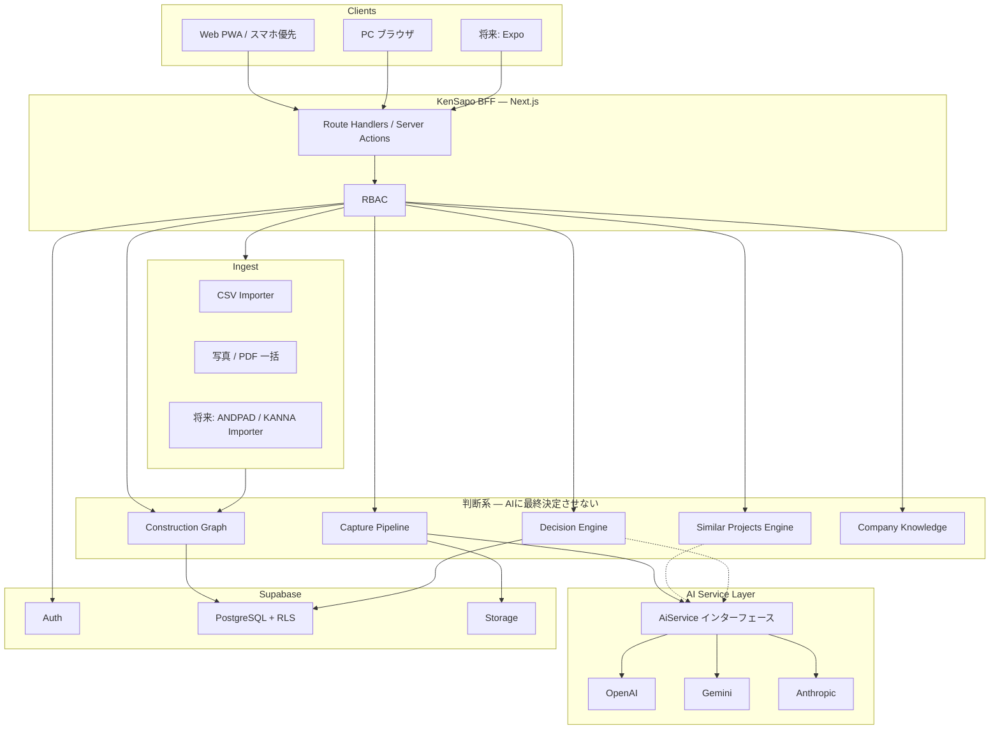
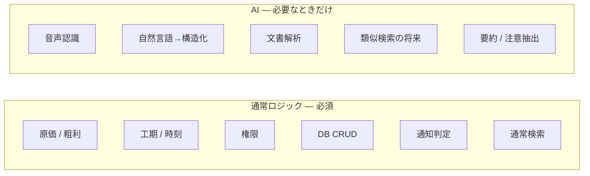

# 2. システムアーキテクチャ

## 一文

現場端末は「撮る・話す・押す」だけを送り、サーバ側で構造化・関連付け・シグナル生成まで行い、人間が確認・判断する。



## レイヤ責務

| レイヤ | やること | やらないこと |
|--------|----------|--------------|
| UI | 大きなボタン、確認質問、結果の提示 | Provider 呼び出し、原価計算、権限の独自判定 |
| BFF | 認証セッション、入力検証、ユースケース実行 | 画面都合のSQL直書きの蔓延 |
| domain | 粗利・工期・人工・権限の純粋計算 | I/O、LLM |
| graph | 案件をハブにした構造化の読み書き | フォルダUIの再現 |
| ai | 音声・言語・文書・類似の補助 | CRUD、通知判定、集計 |
| decision-engine | 推奨・注意・予測の生成 | 工事の自動確定、発注の自動実行 |
| ingest | 外部データの正規化 | 本番テーブルへの画面からの直INSERT |

## リクエストの典型経路

### 現場: 音声で報告

1. 端末が音声を Storage に置く（または直アップロードURL）
2. BFF が `CaptureService.submitVoice`
3. `AiService.transcribe` → テキスト
4. `AiService.structureCapture` → 項目ごとの候補と信頼度
5. 高信頼度は Graph に **候補として** 保存（確定フラグはまだ false）
6. 低信頼度だけ確認キューへ
7. ユーザーが「はい」した項目だけ確定
8. 確定をトリガに Decision Engine を非同期実行

### 経営: 今日の注意

1. BFF が `DecisionEngine.listOpenSignals(org, today)`
2. ルール計算（予定比人工、工程遅延など）は **コード**
3. LLM は使わない
4. UI は「Aマンション 人工消化が予定比 +18%」と出す。「AI分析」とは出さない

## 同期 / 非同期

| 処理 | 同期 | 理由 |
|------|------|------|
| 現場開始・終了 | 同期 | 3タップ以内、即座に今日が変わる |
| 写真メタデータ保存 | 同期 | 撮った感が必要 |
| 写真分類の精緻化 | 非同期 | 待たせない |
| 音声→構造化 | 同期に見せるが内部は短いジョブ | 確認UIまでを1フローにするため、MVPはリクエスト内。遅延時は「整理しています」 |
| 類似案件集計 | 案件作成時に非同期 + キャッシュ | 数百万件をその場スキャンしない |
| シグナル再計算 | キャプチャ確定・日次バッチ | 画面表示は読み取り専用 |

将来のジョブ基盤は Supabase の `pg_cron` / Queue テーブル、または Vercel Workflow / 外部ワーカーへ差し替え可能な `JobRunner` インタフェースにします。MVP は DB の `jobs` テーブル + 定期実行で十分です。

## マルチテナント

```
Organization
  └── Branch?          未使用可
        └── Department? 未使用可
              └── Team?
                    └── Membership → User
  └── Project          必須の作業単位
        └── Construction Graph
```

すべての業務行は `organization_id` を持ちます。NULL テナントは存在しません。

データ分離はアプリケーションフィルタだけでなく **RLS 必須** です。詳細は [05-rls.md](./05-rls.md)。

## セキュリティ境界

```
ブラウザ ── Cookie Session ── Next.js
                │
                ├── service role はサーバのみ（RLSバイパスは Ingest / バッチに限定）
                └── ブラウザ用クライアントは anon + RLS
```

- Storage パスは `{organization_id}/projects/{project_id}/...`
- 署名URLの有効期限は短くする
- 監査は `audit_logs`（重要操作は必ず残す）
- SSO / SCIM / IP制限 / 端末制限 / MFA は `organization_security_settings` の拡張枠のみ MVP で用意

## スケール前提（数百万〜数千万施工データ）

「施工データ」は案件行ではなく、**キャプチャ・写真メタ・人工・材料・シグナル** を含む時系列です。

| 方針 | 内容 |
|------|------|
| ホットパス | `organization_id` 先頭の複合インデックス |
| ハブ | `projects.id` で Graph を辿る。横断検索は特徴量テーブルへ |
| 画像本体 | DB に入れない。Storage |
| 類似 | 都度フルスキャンしない。特徴量 + 候補キャッシュ |
| 古い監査・ジョブログ | 将来 RANGE パーティション |
| 集計 | 経営ダッシュボードは日次スナップショット `org_daily_snapshots` |

## 計算とAIの境界（コスト設計の実装位置）



詳細は [10-ai-service-layer.md](./10-ai-service-layer.md)。

## 環境

| 環境 | 用途 |
|------|------|
| local | Next.js + ローカルまたはリモート Supabase |
| preview | Vercel Preview（テナントは検証用 Org） |
| production | Vercel + Supabase Pro 相当 |

シークレットは Vercel / Supabase のみ。クライアントに出すのは `NEXT_PUBLIC_SUPABASE_URL` と anon key だけです。
