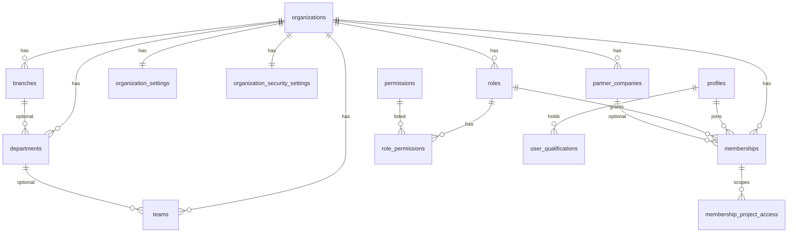
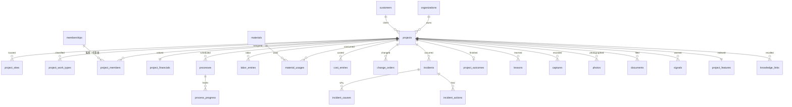
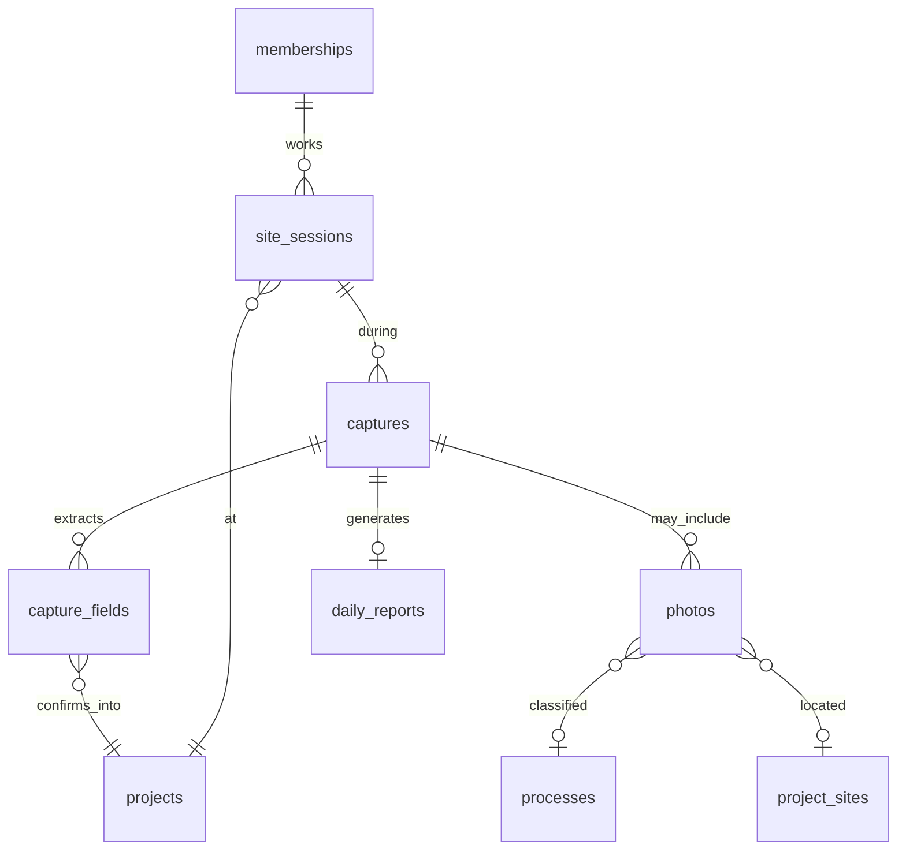
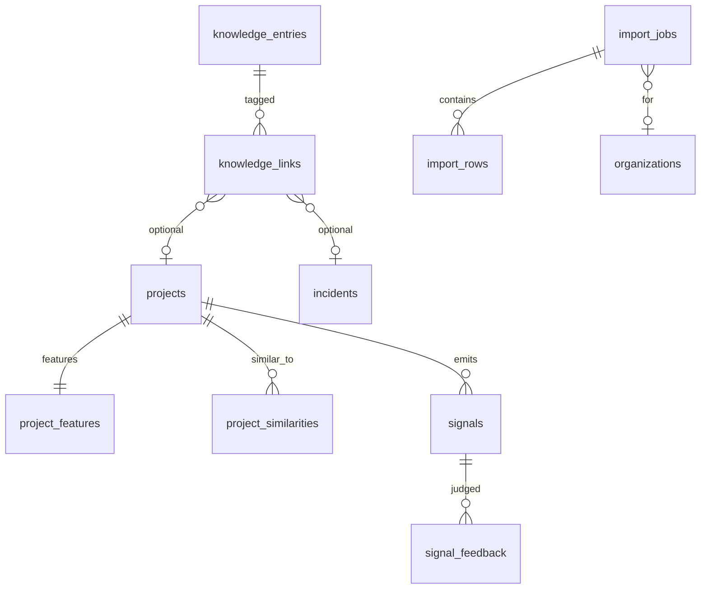

# 4. ER構造

案件（`projects`）をハブにしたスター型です。フォルダや日報を中心にしません。

## 4.1 テナント



Branch / Department / Team はすべて optional。零細は `organizations → memberships → projects` のみ。

## 4.2 Construction Graph（案件ハブ）



要求された施工属性の載せ先:

| 要求項目 | テーブル / 列 |
|----------|----------------|
| 建物種別 | `projects.building_type_key` |
| 工種 | `project_work_types` |
| 工事内容 | `projects.work_summary` |
| 規模 | `projects.scale_value/unit` |
| エリア | `projects.prefecture_code`, `city`, `area_label` |
| 築年数 | `projects.building_year` から算出 |
| 請負金額 | `project_financials.contract_amount` |
| 見積 | `project_financials.estimate_amount` + `estimate_items` |
| 実行予算 | `project_financials.budget_amount` + `budget_items` |
| 予定工期 / 実工期 | `projects.planned_*` / `actual_*` |
| 予定人工 / 実人工 | `labor_entries.kind` |
| 使用材料 / 材料原価 | `material_usages` / `cost_entries` |
| 外注費 | `cost_entries.category = subcontract` |
| 工程 / 進捗 | `processes` / `process_progress` |
| 追加・変更 | `change_orders.kind` |
| 手戻り・トラブル・クレーム | `incidents.kind` |
| 原因 / 対処 | `incident_causes` / `incident_actions` |
| 担当監督 / 作業員 | `project_members.role_in_project` |
| 保有資格 | `user_qualifications` |
| 最終原価 / 売上 / 粗利 / 粗利率 | `project_financials`（粗利率は domain で算出、列は生成またはキャッシュ） |
| 完工結果 / 教訓 / 次回注意 | `project_outcomes` / `lessons` |

## 4.3 Zero Input と写真



日報はキャプチャ確定の投影です。ER上も「親」にしません。

## 4.4 知識・類似・判断・移行



`import_rows` から `projects` への FK は必須にしません。適用が終わってから Graph の ID を書き戻します（疎結合）。

## 4.5 規模のための非正規化

正規化した Graph だけだと、類似「23件・平均工期31日」が全件 JOIN になるため、次を持ちます。

```
projects 1 — 1 project_features
  building_type_key, work_type_keys[], scale_band,
  amount_band, prefecture_code, duration_days,
  labor_days, gross_profit_rate, change_order_flags...
```

特徴量は確定イベント（完工、人工確定、キャプチャ確定）で更新します。類似エンジンはこの表を読みます。
