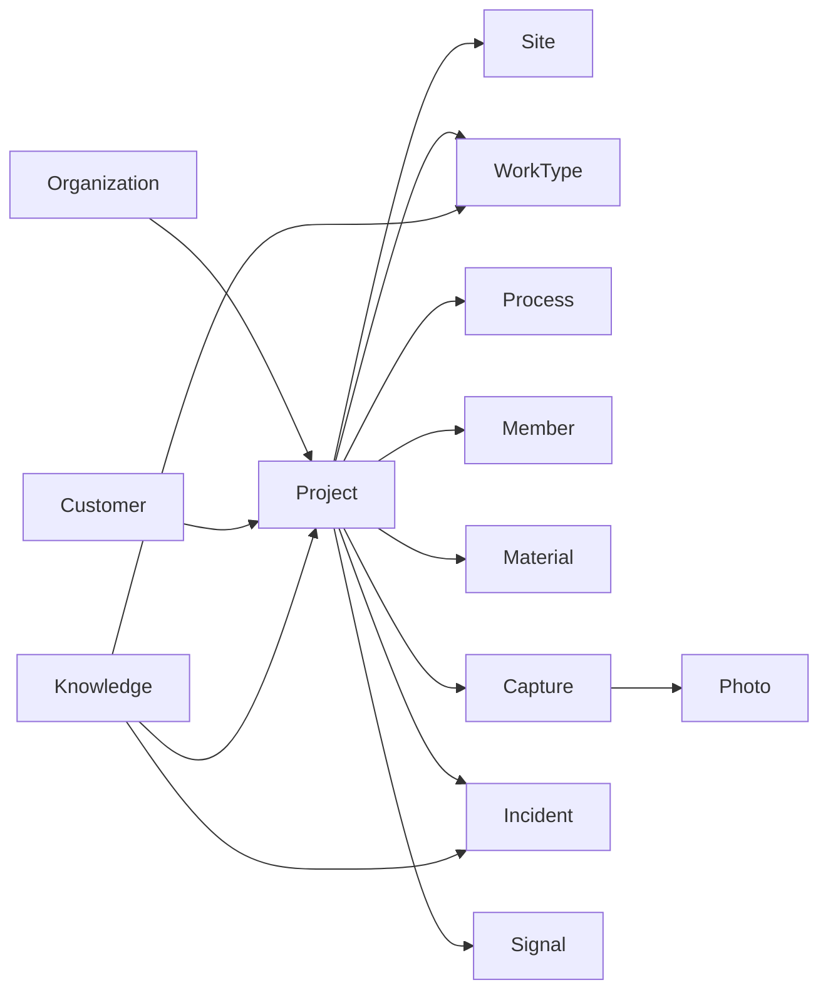

# 11. Construction Graph設計

KenSapo の競争優位の本体。PDF・写真・日報の保管庫ではなく、**案件を中心に施工の事実と判断材料を相互参照できるグラフ** である。

## 目的

記録 → 構造化 → 分析 → 予測 → 提案 → 人間が判断 → 施工 → 結果 → 再びデータ化

このループの「構造化」と「再びデータ化」を Graph が担う。保存するデータは、将来どの判断に使うかを列と紐付けて定義する（[03-database.md](./03-database.md) の対応表）。

## ノードとエッジ（論理）

物理はリレーショナル。論理モデルはグラフとして扱う。



エッジの種類（実装は FK と link テーブル）:

| 関係 | 意味 | 判断での利用 |
|------|------|----------------|
| Project — WorkType | 何の工事か | 類似、知識 |
| Project — Site | どこか | Today、写真 |
| Project — Member | 誰が | 配置、資格 |
| Project — Process | どの順か | 遅延 |
| Capture — Field | 何が起きたか | 人工・材料・進捗 |
| Project — Cost | いくらか | 粗利、赤字 |
| Project — Incident | 何が困ったか | 再発注意 |
| Knowledge — * | 何を学ぶか | 次現場の注意 |
| Project — Project (similarity) | 何に似ているか | 平均工期・変更発生率 |

## 書き込み境界

`packages/graph` だけが案件周辺テーブルを更新する。

```ts
interface ConstructionGraph {
  getProject(orgId: string, projectId: string): Promise<ProjectGraph>;
  applyConfirmedCapture(input: ConfirmedCapture): Promise<void>;
  applyImport(input: NormalizedImportRow): Promise<{ table: string; id: string }>;
  rebuildFeatures(projectId: string): Promise<void>;
}
```

画面も Importer も LLM も、この API を通す。これにより:

- 通常 CRUD とインポートが疎結合
- キャプチャ確定が財務・人工・材料・日報・特徴量を一貫更新
- 将来の専用 Importer が Graph を壊さない

## キャプチャ確定時に伸びるエッジ（例）

音声確定「3階 給水配管 / 田中と2人 / HI25 12本 / 16時終了 / 明日続き」:

| 書き込み | 判断 |
|----------|------|
| process_progress | 工程進捗 |
| labor_entries actual | 人工超過 |
| material_usages | 材料不足・原価 |
| daily_reports | 記録の投影 |
| lessons または next_plan | 翌日 Today |
| project_features 部分更新 | 類似 |
| Decision Engine 再実行 | 注意・推奨 |

## 規模

数百万案件 × 数十〜数百イベントを想定するなら、イベント側が数千万行になる。

| 層 | 内容 |
|----|------|
| 正 | 正規化テーブル（真実） |
| 検索 | `project_features`（類似・フィルタ） |
| 集計 | `org_daily_snapshots` / 必要なら project 日次 |
| 媒体 | Storage（写真・音声・PDF） |

Graph を Neo4j 等に複製するのは Phase 3 以降の選択肢。初期は PostgreSQL で十分。クエリは「案件IDから辿る」を主にし、全社スキャンは features / snapshots に限定する。

## 欠損との付き合い

零細の初期データは穴だらけでよい。必須入力を増やして Graph を埋めない。

埋まっていないノードは類似・予測の重みを下げる。強制しない。埋まっていくほど次の現場の精度が上がる、というプロダクトそのものにする。
