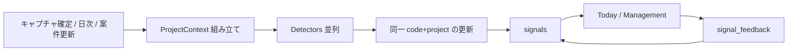

# 12. Decision Engine設計

ユーザーが検索しなくても、重要な変化・リスク・提案を出す。AI に最終決定させない。

## 表示の三分類（これ以外のラベルをUIに出さない）

| 種別 | 意味 | 例 |
|------|------|-----|
| 推奨 | 検討してほしい行動 | 類似現場では着手前に既設ルート確認が多い |
| 注意 | 既に起きている、または閾値を超えた事実 | 人工消化が予定比 +18% |
| 予測 | まだ確定していない見通し | このペースだと完工が遅れる可能性 |

禁止ラベル: AI分析、AI判定、自動決定、ブロック（人間が止められる注意は可だが工事をロックしない）。

## パイプライン



```ts
type SignalKind = 'recommendation' | 'caution' | 'prediction';

interface Detector {
  id: string;
  evaluate(ctx: ProjectContext): Promise<SignalDraft[]>;
}

interface DecisionEngine {
  runForProject(projectId: string, reason: string): Promise<void>;
  listForManagement(orgId: string): Promise<Signal[]>;
  listForToday(orgId: string, membershipId: string): Promise<Signal[]>;
}

interface SimilarProjectEngine {
  findSimilar(query: SimilarProjectQuery): Promise<SimilarProjectResult>;
}
```

Similar は独立エンジン。Decision はそれを呼んで「類似より材料原価 +14%」を作る。

## Detector の種類

| ID | フェーズ | 計算 | kind |
|----|----------|------|------|
| `labor_vs_plan` | MVP | 実人工 / 予定人工 | 注意 |
| `schedule_slip` | MVP | 残工程 vs 残日数 | 注意 |
| `knowledge_match` | MVP | 工種・建物種別リンク | 推奨 |
| `similar_change_rate` | MVP | 類似の追加・変更率 | 推奨 |
| `material_cost_vs_similar` | MVP可 | 類似平均との差 | 注意 |
| `margin_erosion` | P2 | 消化ペース vs 粗利 | 注意 |
| `delay_forecast` | P3 | モデルまたは回帰 | 予測 |
| `labor_forecast` | P3 | モデル | 予測 |
| `cost_forecast` | P3 | モデル | 予測 |
| `deficit_forecast` | P3 | 財務シミュレーション | 予測 |
| `material_shortage` | P2 | 使用ペース | 予測/注意 |
| `staffing_gap` | P2 | 工程 vs 配置 | 推奨 |
| `estimate_outlier` | P2 | 類似金額帯 | 注意 |
| `incident_similar` | P2 | 特徴/埋め込み | 推奨 |
| `additional_work_hint` | P2 | 類似フラグ | 推奨 |

計算できるものはコード。LLM は `incident_similar` の要約など補助に限る。

## ProjectContext（検出器が読んでよいもの）

- 案件属性、工程、人工、原価、変更、インシデント
- 類似サマリ（件数、平均工期、平均人工、平均粗利率、フラグ集計）
- 該当知識
- 当日セッション

検出器は DB を直接叩かず Context を受ける（テスト可能、将来のモデル入力にもなる）。

## 重複とライフサイクル

- 同じ `code + project_id` で open があれば更新（数値を上書き）
- 条件消滅で `resolved`
- ユーザー `dismissed` は同一条件では再掲しない（または Org 設定でクールダウン）
- `accepted` は「人間が見て妥当」という学習データ。自動実行ではない

## Similar Projects Engine（併記）

```ts
interface ProjectFeatures {
  workTypes: string[];
  buildingType?: string;
  scaleBand?: string;
  amountBand?: string;
  buildingAgeBand?: string;
  workSummary?: string;
  region?: { prefecture?: string; city?: string };
  durationDays?: number;
  extra?: Record<string, unknown>;
}

interface SimilarProjectResult {
  matches: { projectId: string; score: number; evidence: Record<string, number> }[];
  stats: {
    count: number;
    avgDurationDays?: number;
    avgLaborDays?: number;
    avgGrossProfitRate?: number;
    flagRates: Record<string, { hit: number; total: number }>;
  };
}
```

MVP `RuleBasedSimilarProjectEngine`:

- 工種一致 高
- 建物種別一致
- 規模バンド近傍
- 金額バンド近傍
- 築年バンド
- 地域（都道府県 > 市区）
- 工期近傍
- 工事内容のトークン重複

重みは定数。`EmbeddingSimilarProjectEngine` は同じインタフェースで置換。

## Management への写像

エンジンはシグナルのリストを返すだけ。画面は件数集計と「注意」の上位を並べる。

```
稼働現場：18     ← site_sessions / 稼働中プロジェクト（コード）
完了予定：4     ← planned_end_on = today（コード）
遅延注意：2     ← signals code=schedule_slip open（エンジン）
```

数字の壁ではなく、行クリックで案件ハブ（根拠付き）へ。
