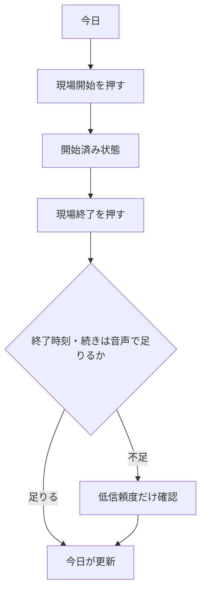
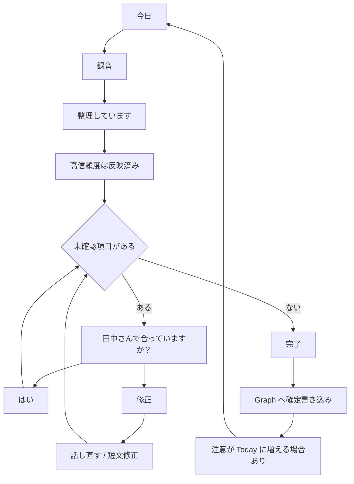
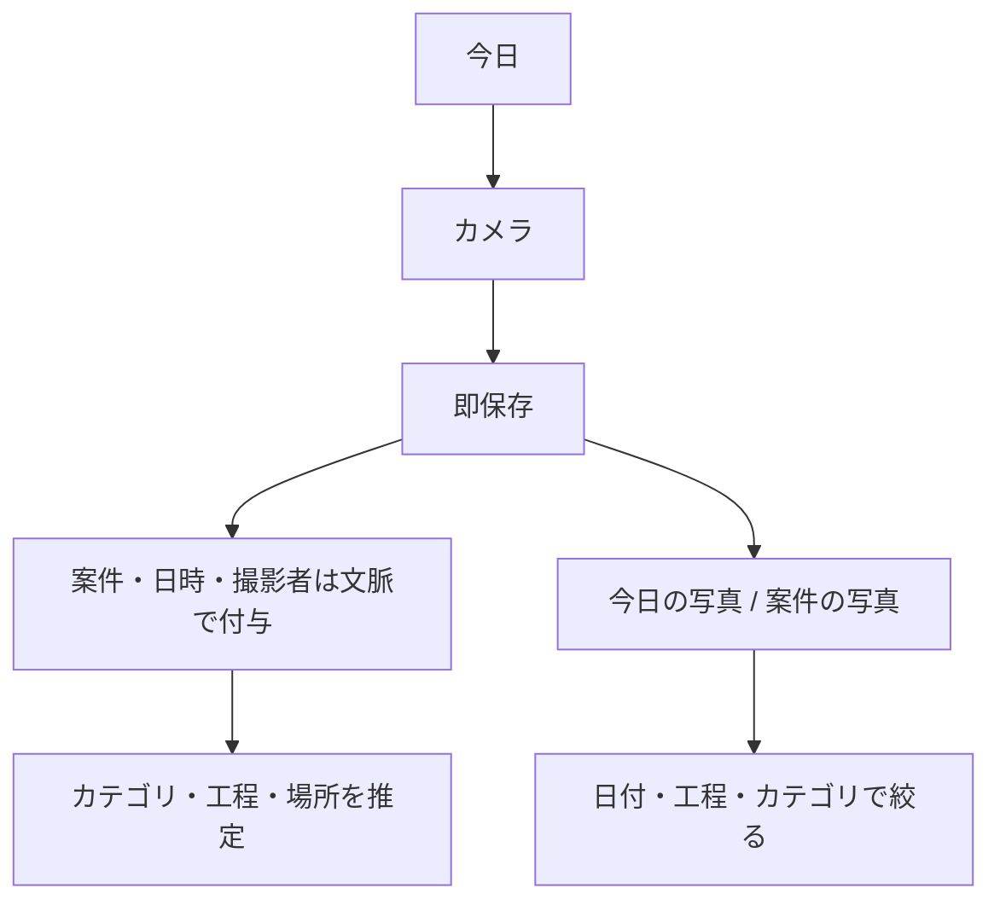
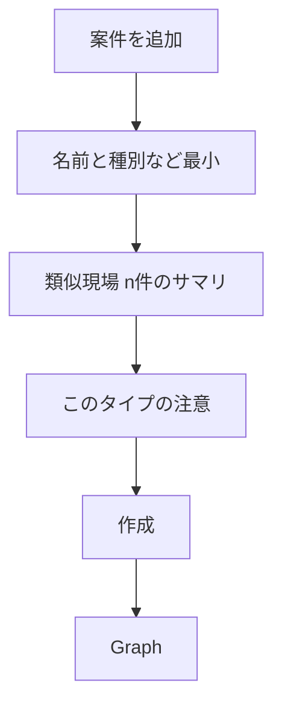

# 13. Zero Input UXの画面遷移

基本操作は **撮る・話す・押す**。システムのためのフォームをホームに置かない。

## 13.1 現場ホーム（ログイン後）

スマートフォン既定。PCでも現場シェルなら同じ情報を大きく出す。

```
今日
  現場名
  開始 8:30
  住所（地図を開く）
  担当者
  必要資料
  今日の作業
  注意事項（知識・類似・シグナル。ラベルは注意/推奨）

  [ 現場開始 ]  [ 写真を撮る ]
  [ 音声で報告 ] [ 現場終了 ]
```

階層はここが第1層。重要操作はここから 1〜2 タップ。

## 13.2 現場開始 / 終了



開始はワンタップ。位置情報は取れれば付与、拒否されても止めない。  
終了もワンタップ。不足項目があれば音声フローへ誘導（フォーム全員分は出さない）。

## 13.3 音声で報告（中核）



確認UIのルール:

- 一度に一問
- 文言は現場の言葉。「エンティティ抽出結果をレビュー」などは禁止
- 選択肢は **はい / 修正** が基本。修正は音声か一行入力
- 3問を超えるなら「残りは後で」で Today に戻し、バッジで再開

例:

> HI25 を 12本 で合っていますか？  
> [はい]  [修正]

## 13.4 写真を撮る



保存を分類より先にする（待たせない）。フォルダ作成・ファイル名入力は出さない。  
推定が外れていれば写真詳細でカテゴリを直す（任意）。必須にしない。

一括アップロード（事務）も同じ分類パイプライン。差分は入力がフォルダ選択ではなくファイル列なことだけ。

## 13.5 新規案件と類似（管理・事務。現場ホームには出さない）



類似を見るために全項目入力させない。分かる範囲だけでスコアする。

## 13.6 知識の残り方

専用の「ナレッジ管理システム」を現場に見せない。

- 完工やトラブル確認の流れで「次に残すこと」を一問
- 管理画面から一文追加は可能
- Today の注意事項として再登場

## 13.7 やらない遷移

- ホームに AI チャット
- 日報フォームが主経路
- 写真フォルダツリー
- 現場ユーザーが経営ダッシュボードを横切る
- 確認のために10項目のテーブル編集を出す
